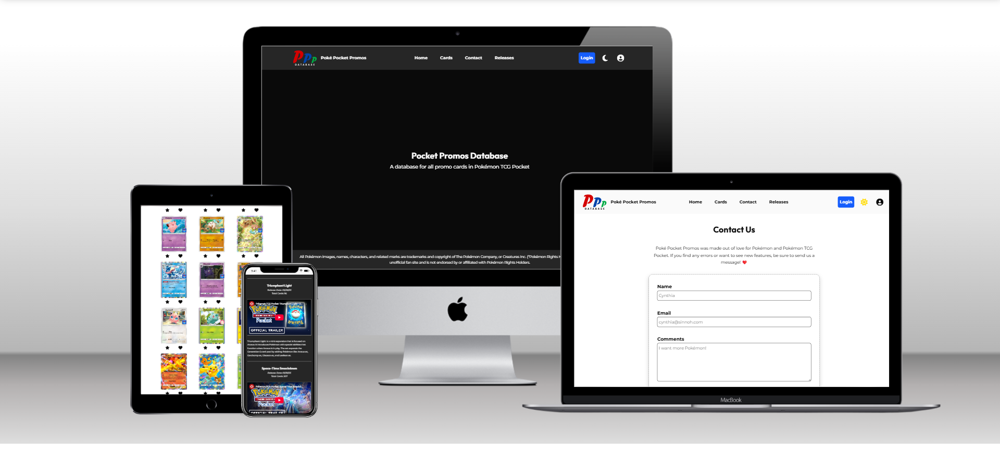

# Poké Pocket Promos

A card database app for promo cards in Pokémon TCG Pocket. This is my final project for CSCE 242 Web Applications at the University of South Carolina.

## Poké Pocket Promos API

🌐 [API](https://poke-pocket-promos-backend.onrender.com/)

📁 [Repo](https://github.com/not-josue/poke-pocket-promos-backend)

Requires the Poké Pocket Promos API to be running. Uses a free deployment on [Render.com](https://render.com/) so may take some time to render, and may only run for 15 minutes before backend goes down.

## Data

Images and JSON used by the site also kept locally for testing.
